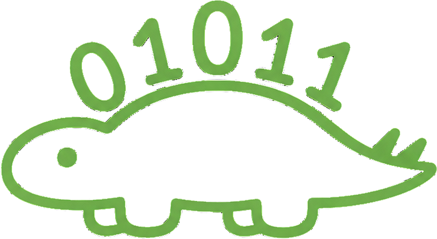
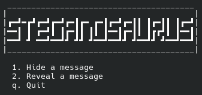

<p align="center">
  
</p>

<h1 align="center">SteganoSaurus</h1>

<p align="center">
  Hides a message inside ordinary text written by a local language model.
</p>

---

> **Status: v0.1, work in progress.** Learning project, unaudited.

## What it is

Conventional encryption produces obvious gibberish - anyone can tell something is being hidden. SteganoSaurus hides the **existence** of the message: the output is readable text that looks like plain model output.

Decoding requires the same model and the same context prompt, making it one of the most secure ways to encrypt the message.

## How it works

At each step the model proposes a ranked list of likely continuations. Both sides running the same model see the **same list**. The message is encoded not as letters but as a *choice* from that list: bit `0` picks the first candidate, bit `1` picks the second.

The receiver runs the text through the same model, observes which candidate was chosen, and recovers the bits.

## Install

```bash
git clone https://github.com/adambovzdarenko/SteganoSaurus.git
cd SteganoSaurus
python -m venv venv && source venv/bin/activate
pip install llama-cpp-python numpy
```

The model is not bundled - download a `.gguf` and put into the "/models" folder.

## Usage

```bash
python SteganoSaurus.py
```
or
```bash
python encode.py
python decode.py
```



## Threat model
 
- Works against someone who reads the cover text and has no reason to look closer.
- Doesn't work against somebody with a bit of curiousity, especially if they have your model and passphrase - this is a natural fallback.
If you leak your text with passphrase and model - congratulations, your stegosaurus died.

In other words: your machine is the evidence itself.

Not covered: Traffic metadata
> Michael Hayden:  “We Kill People Based on Metadata"
 
Also worth knowing:
 
- The salt is fixed for the whole project, so weak passphrases are cheap to attack in bulk.
- One passphrase decrypts every message you ever sent with it.
- Cover length tracks message length - no padding, so size leaks.
- A single changed character desyncs the decoder and kills the rest of the message. Move
  cover text as a file, never retype or paste it through something that touches whitespace.
v0.1 has no encryption at all. The prompt is the only secret, and short English phrases
are brute-forceable. ChaCha20 + Argon2id land in v0.2. (very soon)
 
Unaudited learning project. Don't use it where getting caught matters.


## Roadmap

- [x] v0.1 - top-2, one bit per token
- [ ] v0.2 - encryption, top-k, 3 bits per token
- [ ] v1 - arithmetic coding
- [ ] v2 - ?

## Notes

- The better the model you use, the more natural the output will look.
- Do not use this for anything other than learning and your own privacy. NEVER USE IT FOR CRIMINAL PURPOSES. AND EVEN WORSE - DO NOT SELL SOFTWARE BUILT ON THIS METHOD. PRIVACY IS A HUMAN RIGHT, NOT A PRODUCT!

## Reference

Ziegler, Deng, Rush. *Neural Linguistic Steganography*, EMNLP 2019.
https://aclanthology.org/D19-1115/

## License

AGPL-3.0
